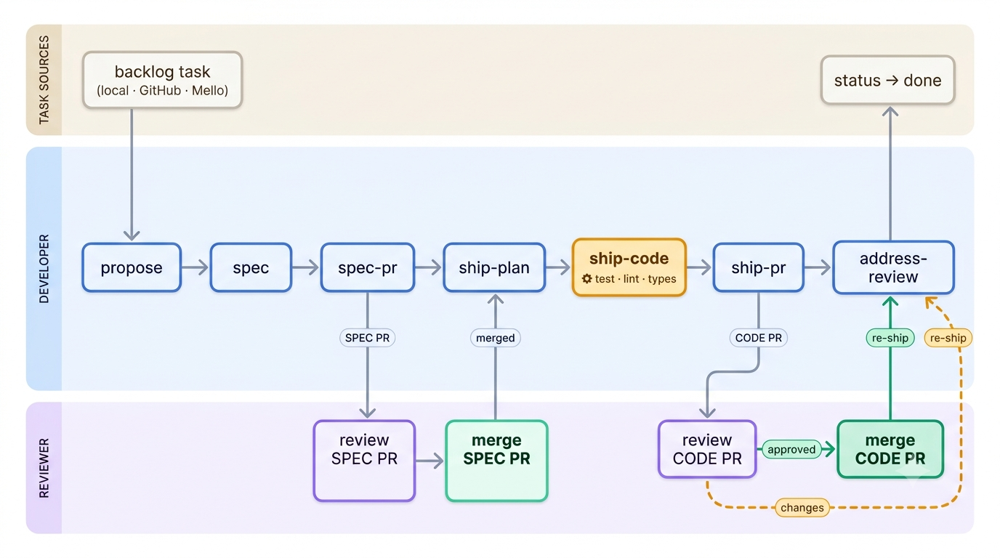

<p align="center"><strong>mzspec</strong></p>

<p align="center">
A reusable, installable <strong>spec-driven delivery pipeline</strong> for AI coding agents —
built on the same artifact model as <a href="https://github.com/Fission-AI/OpenSpec">OpenSpec</a>,
implemented natively (no external CLI required).
</p>

<p align="center">
<a href="LICENSE"></a>
<a href="https://github.com/minhlucncc/mzspec/releases"></a>
</p>

```
→ spec-first not chat-history
→ gated not yolo
→ human merges not AI commits
→ zero-config not config-sprawl
→ polyglot not single-language
```

> [!TIP]
> **v0.12.0** — **tag-driven skill routing**: tasks carry tags (`ui`, `backend`, `api`, `db`, ...),
> skills and hooks declare which tags they apply to, and the **tag resolver** loads only the
> relevant guidance per work-unit — no conditional text, no irrelevant prompts. Zero-config for
> existing projects (tags are optional; un-tagged units get universal skills as before).
> → [Tag system docs](docs/03-guides/02-tag-system.md) · `./mzspec docs` for the full workflow overview

## How a change flows

A standard SDLC laid out as three swimlane **rows** (top → bottom: **Task Sources · Developer ·
Reviewer**). The change flows left → right, crossing a **human merge gate** at each PR.

<p align="center">
  
</p>

> The agent never self-merges — a human merges both the **SPEC PR** (the contract) and the
> **CODE PR** (the implementation) via `/opsx:merge-pr`, which also archives the change and fires
> the `*-merged` lifecycle hooks that sync the backlog ticket.

## See it in action

mzspec drives a change from a prompt to two reviewed PRs — a spec contract, then the code that
fulfills it — without ever letting the agent commit to `main`.

```text
You: /opsx:propose add-dark-mode        (or /opsx:propose-gh 90 from a GitHub issue)
AI:  ✓ scaffolded openspec/changes/add-dark-mode/, branch created, proposal.md drafted

You: /opsx:spec
AI:  ✓ proposal.md, specs/, tasks.md reviewed across 6 axes — validate passing

You: /opsx:spec-pr
AI:  ✓ delta synced into canonical openspec/specs/ → opened SPEC PR
Reviewer: reviews & merges the contract into main

You: /opsx:ship
AI:  ✓ ship-plan — test-first work-units laid out in .handoff/add-dark-mode/
     ✓ ship-code — Red → Green → one commit per unit
     ✓ gates resolved from the diff and passing (test · lint · types · validate)
     ✓ evidence collected
You: /opsx:ship-pr
AI:  ✓ opened CODE PR with the evidence digest
Reviewer: reviews, leaves comments

You: /opsx:address-review
AI:  ✓ fixed the feedback, re-ran gates, updated the PR        (loop as needed)
Reviewer: /opsx:merge-pr → merged, change archived, ticket linked, lifecycle hooks fired
```

## Quick start

```bash
# Requires: node and git

# 1. Install the core pipeline
curl -fsSL https://raw.githubusercontent.com/minhlucncc/mzspec/main/scripts/install.sh | bash

# 2. Add the extensions you want
./mzspec ext add agent-skills
./mzspec ext add task-github

# 3. See what's available / installed
./mzspec ext list

# 4. View the full workflow overview
./mzspec docs
```

The installer vendors the core pipeline into your project's `.claude/`, writes an **`SDD_GUIDE.md`**
to orient humans and agents, installs the **`./mzspec`** unified CLI to your project root, and
stamps the release in `.claude/.mzspec-version`. OpenSpec is bundled natively — no `npm i -g`
required. Gates are **zero-config**: auto-discovered from your repo's own manifests
(`pyproject.toml` / `go.mod` / `pnpm-workspace.yaml`), so no `mzspec.config.json` is needed.

The installer is idempotent — re-run anytime; `--force` overwrites vendored files and `--upgrade`
refreshes them and runs pending migrations. See [docs/01-getting-started/01-install.md](docs/01-getting-started/01-install.md).

## Extension management

`./mzspec` is the entry point for adding capability on top of the core pipeline:

| Command | What it does |
|---|---|
| `./mzspec ext list [--available\|--installed]` | List extensions |
| `./mzspec ext info <name>` | Show what an extension provides |
| `./mzspec ext add <name> [--force]` | Install an extension |
| `./mzspec ext remove <name>` | Remove an extension |

Other core commands:

| Command | What it does |
|---|---|
| `./mzspec docs` | Show the full SDD workflow overview (pipeline + extensions + hooks) |
| `./mzspec version` | Show the installed mzspec version |
| `./mzspec spec <subcommand>` | OpenSpec change management (init, new, validate, status, list, archive) |
| `./mzspec discover` | Auto-discover toolchains from project manifests |
| `./mzspec template <subcommand>` | Manage planning templates (list, show, path, create, remove) |
| `./mzspec hooks list` | List registered agent and prompt hooks |

Run `./mzspec help` for the full command tree, or `./mzspec <command> --help` for subcommand details.

Each extension is self-contained under `extensions/<name>/` with its own `install.sh` /
`uninstall.sh`. Updating is handled by `./mzspec update` (or `scripts/update.sh` from a
checkout) — see [Updating](#updating).

Now drive the pipeline:

- **Start a change** → `/opsx:propose <what-to-build>` scaffolds it (or `/opsx:propose-gh <issue>`,
  from the **task-github** extension, to start from a GitHub issue and link the two).
- **Then run the flow** → `/opsx:spec` → `/opsx:spec-pr` (reviewer merges the contract) →
  `/opsx:ship-plan` → `/opsx:ship-code` (or `/opsx:ship` for both) → `/opsx:ship-pr` →
  `/opsx:address-review` (as needed) → `/opsx:merge-pr`.

## Docs

The documentation is organized as a learning path from getting started to advanced:

→ **[Start here: docs/README.md](docs/README.md)** — learning path index

Quick links by tier:

| Tier | Guides |
|------|--------|
| Getting Started | [Install](docs/01-getting-started/01-install.md) |
| Concepts | [SDD](docs/02-concepts/01-sdd-intro.md), [Claude Code workflow](docs/02-concepts/02-claude-code-workflow.md), [Enterprise](docs/02-concepts/03-enterprise-sdd.md), [Future](docs/02-concepts/04-future-agent-sdlc.md) |
| Guides | [Architecture](docs/03-guides/01-architecture.md), [Tag system](docs/03-guides/02-tag-system.md), [Config](docs/03-guides/01-customize.md), [Templates](docs/03-guides/02-templates.md), [Commit conventions](docs/03-guides/03-commit-convention.md) |
| Extensions | [task-github](docs/04-extensions/01-task-github.md), [Orchestrator](docs/04-extensions/02-orchestrator.md) |
| Reference | [Hooks](docs/05-reference/01-hooks.md), [Lifecycle](docs/05-reference/02-lifecycle-hooks.md), [Gates](docs/05-reference/03-gate-plugin.md), [Adapters](docs/05-reference/04-adapter-contract.md), [Mework](docs/05-reference/05-mework-integration.md) |

## Why mzspec?

AI agents ship fast, but quality and intent drift when requirements live only in chat history and
nothing stands between a generated diff and `main`. mzspec adds a gated, test-first delivery layer
on top of OpenSpec's spec artifacts — so every change is specced, gated, reviewed, and merged by a
human, on any project, with one install.

- **Claude-native workflow core** — the `/opsx:*` command spine (`propose`, `spec`, `spec-pr`,
  `ship-plan`, `ship-code`, `ship`, `ship-pr`, `address-review`, `author-review`, `merge-pr`,
  `template-*`)
  drives the whole pipeline inside your coding agent, vendored to `.claude/`. The agent runs the
  flow; you review.
- **Native OpenSpec** — the spec/change/archive model is implemented in `lib/openspec.js` (pure
  Node, no external binary or npm dependency).
- **Tasking & handoff** — a handoff system (`.handoff/<change>/`) paces the agent through a long
  spec unit-by-unit (Red → Green → one commit), with optional backlog tasking on the front.
- **Hooks to customize behavior** — `resolve-gates` shapes the gate plan for any toolchain, and
  lifecycle hooks fire at every milestone (best-effort board/ticket sync that never fails the ship).
- **Zero-config polyglot gates** — the resolver maps a diff to the exact per-toolchain checks,
  auto-discovered from your `pyproject.toml` / `go.mod` / `pnpm-workspace.yaml`.
- **Two-PR human-merge gate** — a spec PR (contract) merges first, then a code PR implements it;
  the human always merges, the agent never commits to `main`. Shipping can run in an isolated git
  worktree to keep your working tree clean.

### Smart tagging (skill routing)

Every task and work-unit carries **tags** (`ui`, `backend`, `api`, `db`, `auth`, ...) that declare
what kind of work it is. Skills and hooks declare which tags they apply to in YAML frontmatter.
The **tag resolver** matches them at runtime — a backend unit never sees UI guidance, and a UI
unit automatically gets the `ui-design` skill and UX pattern hooks.

- **Tag tasks** in `tasks.md`: `## Task [1]: Login form  (tags: ui, auth)`
- **Tags drive skill loading** — no conditional "if UI" text in prompts
- **Tags auto-inferred** from file paths via `mzspec.config.json` → `tags.categories`
- **Extensible** — projects define custom tags and create matching `SKILL.md` files
- **Backward compatible** — un-tagged units get universal methodology skills as before

→ [Full tag system documentation](docs/03-guides/02-tag-system.md)

### Extensions

- **`agent-skills`** (`./mzspec ext add agent-skills`) — the **agent-skill workflow standard**:
  engineering-practice skills (TDD, code review, security, debugging, docs/ADRs, git workflow,
  CI/CD, and more) under `.claude/skills/`, routed onto the `/opsx:*` lifecycle by the
  `using-agent-skills` meta-skill, plus a prompt hook for each pipeline phase.
- **`task-github`** (`./mzspec ext add task-github`) — GitHub-backed tasking: `/opsx:propose-gh
  <issue>` starts a change from a GitHub issue and links the two, `/opsx:task-log` comments on the
  linked issue, and `/opsx:task-assign` assigns it (defaults to `@me`). Installing it wires the
  spec→ship pipeline to GitHub via the lifecycle hooks; the issue ↔ change link + PR refs live in
  `openspec/changes/<change>/github.json`.
### How we compare

**vs. OpenSpec alone** — OpenSpec defines the spec-artifact model; mzspec implements it natively
and adds the delivery pipeline and gate engine on top of those same artifacts. It never creates a
parallel store — everything still lives under `openspec/`.

**vs. hand-rolled CI scripts** — gates are derived from the diff and your manifests, not a bespoke
pipeline you maintain per repo. A new package is gated the moment it has a manifest.

**vs. nothing** — no spec contract, no gates, no human merge gate: the agent's intent and your
intent drift apart in chat history. mzspec makes the contract explicit and enforced.

## How it works

The gate-resolver turns a diff into a gate plan through a 3-step chain: an executable
`openspec/hooks/resolve-gates` (full override, any language) → a `mzspec.config.json` (explicit
pin, optional, kept for back-compat) → **zero-config auto-discovery** from your manifests
(`lib/discover.js`, the default). The ship pipeline is a state machine where the spec PR (contract)
merges before the code PR (implementation), and a human always performs the merge. Architecture:
[docs/03-guides/01-architecture.md](docs/03-guides/01-architecture.md) · [docs/03-guides/01-customize.md](docs/03-guides/01-customize.md).

## Updating

```bash
./mzspec update           # or: bash scripts/update.sh
```

Updating is idempotent: it re-vendors mzspec-owned files, runs the pending migrations between your
project's stamped `.claude/.mzspec-version` and the current release, and prunes artifacts of
removed features — project-owned files are preserved. See [CHANGELOG.md](CHANGELOG.md).

## License

MIT. Engineering-practice skills are adapted from
[addyosmani/agent-skills](https://github.com/addyosmani/agent-skills) (MIT) — see
[ATTRIBUTION.md](ATTRIBUTION.md).
