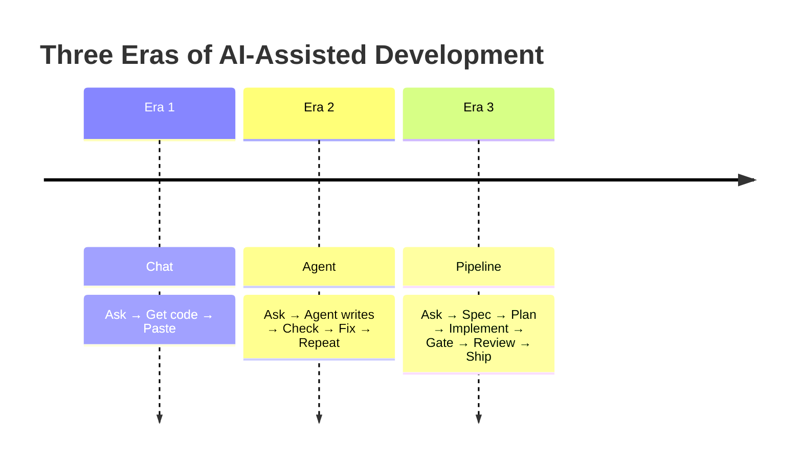

# The Claude Code Workflow: A Game Changer

## Chat → Agent → Pipeline

The way we use AI for software development has gone through three eras:

In **Era 1**, you pasted the AI's response into your editor. Every generation was a one-shot.
Repetition was manual. Quality was whatever the model produced on that particular prompt.

In **Era 2**, the agent can read files, run commands, and iterate. This is dramatically more
powerful — but still unstructured. The agent decides what to do next based on the conversation
history. There's no spec, no gate, no review. The quality of the output depends on how well you
prompted, not on any systematic process.

**Era 3 is the pipeline.** The agent doesn't free-assemble a solution from chat history. It follows
a structured workflow — propose, spec, spec-review, spec-PR, plan, implement, verify, review,
ship — with human gates at the critical points. The `/opsx:*` commands in mzspec make this
possible inside Claude Code.

## What Changes

### Specs are artifacts, not conversation

In a chat-driven workflow, the "spec" is whatever you said in the last few messages. Close the
terminal, it's gone. Switch to a different task, it's gone. Resume a session, the context window
has moved on and the requirements are lost.

In the pipeline workflow, specs live in `openspec/changes/<name>/`. They're files. They survive
session boundaries, agent restarts, and team handoffs. The agent reads them, implements against
them, and the **reconcile step** in `ship-code` checks that the implementation still matches.

### Gates replace "please check this"

Without gates, quality depends on the agent being careful on that particular run. With gates,
every change must pass the resolver-selected checks — lint, typecheck, test, validate —
before it can reach a human. The gates are **deterministic** and **auto-discovered** from your
project's manifests. A new Python package gets `ruff` + `pyright` + `pytest` the moment its
`pyproject.toml` appears.

### The handoff paces the agent

Without a handoff, an agent either builds everything at once (risk: overbuilding, going off-track)
or needs constant human direction. The handoff system (`.handoff/<change>/`) breaks the change
into test-first work-units: a few units per change, each with its own Red → Green → commit cycle.
The agent implements one unit at a time, and you can review the plan before execution begins.

## The Command Spine

The pipeline exposes natural-language commands that any Claude Code session can run:

| Command | What happens |
|---------|-------------|
| `/opsx:propose "add dark mode"` | Scaffolds a change with proposal, design, tasks, delta specs |
| `/opsx:spec` | Reviews the spec across 7 axes, fixes issues, writes REVIEW.md |
| `/opsx:spec-pr` | Syncs delta specs to canonical, opens a spec-only PR |
| *(human merges the spec PR — the contract is locked)* |
| `/opsx:ship-plan` | Groups tasks into TDD work-units, writes `.handoff/` |
| `/opsx:ship-code` | Implements unit-by-unit: Red → Green → commit → verify → review → evidence |
| `/opsx:ship-pr` | Opens the code PR with the evidence digest |
| `/opsx:address-review` | Fixes PR feedback, re-runs gates, updates the PR |
| `/opsx:merge-pr` | Merges the PR, archives the change, fires lifecycle hooks |

Each command is a **deterministic workflow** — the same inputs produce the same sequence of
operations. The agent doesn't decide the process; it executes it.

## The Human Role

The human in this workflow is a **reviewer**, not a writer. You:

1. **Review the spec** — is the proposal clear? Are the edge cases covered? Is the design sound?
2. **Merge the spec PR** — locking the contract before code starts.
3. **Review the handoff** — are the work-units well-grouped? Is the order right?
4. **Review the code PR** — gates already passed; you're checking the diffs.
5. **Leave feedback** → `/opsx:address-review` fixes it and re-runs gates.
6. **Merge the code PR** — the change is done.

The agent does the writing, testing, and gating. You do the thinking and deciding.

## Why It's a Game Changer

| Problem with ad-hoc agent use | How the pipeline solves it |
|------------------------------|---------------------------|
| Quality varies with prompt quality | Gates enforce deterministic quality checks |
| Context is lost between sessions | Spec artifacts persist on disk |
| Agent goes off-track | Handoff paces the work; gate failures stop the pipeline |
| No audit trail | Every phase leaves artifacts: REVIEW.md, evidence/, plan.json |
| Hard to hand off to another agent | Specs and handoffs are files — any agent can read them |
| Human becomes the reviewer | Pattern enforced: human merges, agent writes |

The pipeline doesn't make the agent smarter. It makes the agent's work **repeatable, verifiable,
and reviewable** — which is what turns AI-assisted coding from a demo into a delivery process.

---

→ **Read:** [Enterprise-Grade SDD](03-enterprise-sdd.md) — what it takes to run this at scale.
→ **Try it:** [Install mzspec](../01-getting-started/01-install.md) and run your first change.
