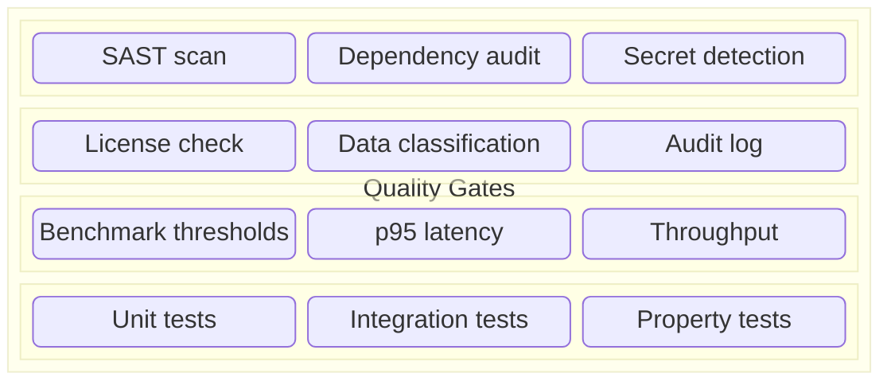

# Enterprise-Grade SDD: What It Takes

A spec-driven pipeline works for a solo developer on a side project. Making it work for a team,
across multiple repos, with compliance requirements and production SLAs, takes more. This article
bridges the gap between "it works on my machine" and "it works for the enterprise."

## Spec Discipline at Scale

In a small project, one person owns the spec. In an enterprise, specs cross teams, time zones,
and quarterly planning cycles.

**Who owns specs in a multi-team org?**
- The **proposal** is owned by the PM or tech lead who identifies the need.
- The **design** is owned by the engineer(s) implementing the change — with review from adjacent
  teams whose systems are affected.
- The **delta specs** are a shared contract — the team that owns the capability reviews and merges
  the spec PR before code starts.
- The **tasks** belong to the implementer — they're how the work is paced.

**Versioning specs alongside code** is critical. Delta specs are checked into `openspec/specs/`
alongside the source code. A `git log -- openspec/specs/search/spec.md` shows exactly when and why
each requirement changed. This is not possible with Jira, Notion, or Google Docs.

**Spec drift at scale** is the #1 risk. When teams move fast, the code evolves and the spec
stagnates. mzspec addresses this with:

- The **reconcile step** in `ship-code`: after implementation, it re-syncs delta specs against
  canonical. If the implementation changed the contract, the pipeline stops.
- The **spec review gate**: every change must pass `openspec validate --strict` before it ships.
  This catches format errors, dangling references, and missing scenarios.

## Gates as Quality Policy

In a small project, gates mean "run the tests." In an enterprise, gates encode policy:

mzspec's gate system supports this through:

- **Custom gates** — any executable that exits 0 on pass, non-zero on fail. Drop scripts in
  `customGates` with `when` predicates (`touches`, `toolchains`). See [Gate plugins](../05-reference/03-gate-plugin.md).
- **Bench gates** — fast cross-cutting suites that run when specific paths or toolchains are touched.
- **Always gates** — checks that run on every change (e.g., `openspec validate`).
- **Migration gates** — database migration checks that run only when migration files are touched.

The key insight: **gates are discovered from the diff, not hand-configured**. A new package gets
the right gates automatically because `lib/discover.js` reads your `pyproject.toml` / `go.mod` /
`pnpm-workspace.yaml`. Zero-config is the enterprise default; overrides are for exceptions.

## Audit Trail

Every change in the mzspec pipeline leaves a trail:

| Phase | Artifact produced |
|-------|------------------|
| Spec review | `REVIEW.md` — 7-axis findings, severity, verdict |
| Ship plan | `.handoff/<change>/plan.json` — unit grouping, dependencies |
| Implementation | Per-unit Red → Green commits with messages linking to the change |
| Verification | Gate result logs, test output, coverage reports |
| Review | Code review findings by severity |
| Evidence | `evidence/gates.md`, `evidence/test-results.md`, `evidence/coverage.txt` |

This is not optional metadata. It's **version-controlled artifacts** in the same repo as the code.
When an auditor asks "what happened with change c0042?", the answer is in `openspec/changes/archive/`.

## Lifecycle Integration

An enterprise SDD pipeline doesn't exist in isolation. It connects to:

- **Issue tracking** — a change starts from a ticket, and every milestone (spec started, spec PR
  opened, spec merged, code PR opened, code merged) syncs back to the ticket.
- **Project boards** — columns update automatically as changes progress through the pipeline.
- **CI/CD** — gates that run locally should also run in CI. The gate-resolver output is a JSON
  plan that CI can execute independently.
- **Slack/Teams** — lifecycle hooks can fire notifications at key events.

mzspec's [lifecycle hooks](../05-reference/02-lifecycle-hooks.md) and [task-github](../04-extensions/01-task-github.md)
extension handle this. The `github.json` SSOT keeps the change ↔ issue link in a single file.

## Human-in-the-Loop That Scales

The bottleneck in any enterprise pipeline is **human review time**. mzspec's two-PR model is
designed to make every human review count:

- **Spec review** catches logic errors, missing scenarios, and design flaws *before code is written*.
  A 10-minute spec review prevents hours of rework.
- **Code review** sees a diff that has already passed gates. The reviewer focuses on readability,
  architecture, and whether the implementation matches the spec — not on formatting or typos.
- **The orchestrator** (see [Orchestrator](../04-extensions/02-orchestrator.md)) adds a layer above:
  it spawns separate agents for ideation, implementation, and audit, so humans interact only
  at the orchestration level — setting strategy, reviewing outputs, approving merges.

## Multi-Project and Monorepo

mzspec's **zero-config toolchain discovery** handles polyglot repos natively:

- Each directory with a `go.mod` is a Go toolchain.
- Each directory listed in `[tool.uv.workspace].members` is a Python toolchain.
- Each `pnpm-workspace.yaml` package with a `lint` script is a TS toolchain.

The **gate resolver** (`lib/gate-resolver.js`) maps every touched file to its owning toolchain
by longest-prefix match, deduplicates gates, and runs them in the correct order. No config needed.

## What's Needed Next

Enterprise-grade SDD is still early. The next capabilities:

| Capability | Why it matters |
|-----------|---------------|
| **Spec diff tooling** | Visual diff between spec versions — what requirements changed, added, or removed |
| **Spec coverage analytics** | What % of requirements have passing tests? What scenarios are untested? |
| **Rollback workflows** | When a change needs to be unshipped, the spec should roll back too |
| **SLA gates** | "This endpoint must respond in < 200ms p99" — gates that enforce performance contracts |
| **Cross-change dependency tracking** | Change B depends on change A's spec being merged first — visible in the pipeline |
| **Compliance dashboards** | Per-team, per-project audit views: how many changes passed gates, average review time, spec coverage |

These are on the roadmap. The foundation — gated, spec-first, human-reviewed delivery — is here now.

---

→ **Next:** [The Future of Agent-Driven SDLC](04-future-agent-sdlc.md) — where this is all heading.
→ **Related:** [Workflow hooks](../05-reference/01-hooks.md), [Custom gates](../05-reference/03-gate-plugin.md)
