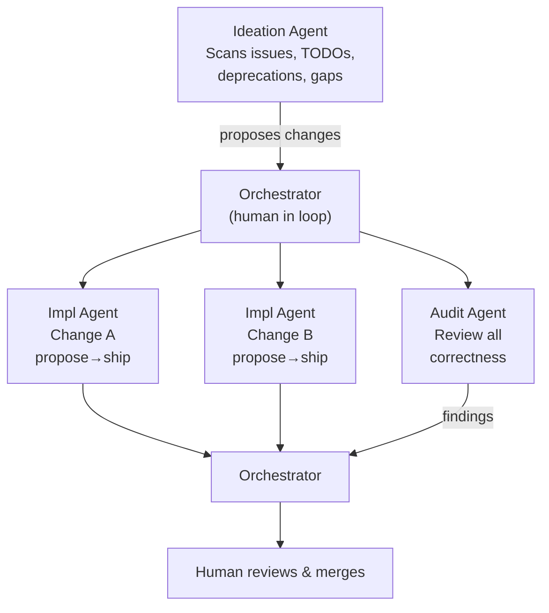
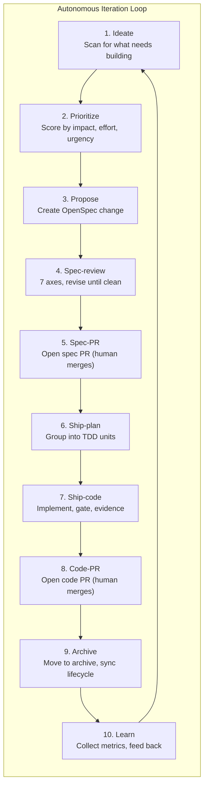

# The Future of Agent-Driven SDLC

## Where We Are Today

Today's mzspec pipeline is a **single-agent, sequential, human-gated** workflow:

```mermaid
flowchart LR
    HI["Human intent"] --> AP["Agent proposes"]
    AP --> AS["Agent specs"]
    AS --> HR1["Human reviews spec"]
    HR1 --> APL["Agent plans"]
    APL --> AI["Agent implements"]
    AI --> GV["Gates verify"]
    GV --> HR2["Human reviews code"]
    HR2 --> HM["Human merges"]
    HM --> ARCH["Archive"]
```



One agent, one change, running a deterministic sequence of phases. The human makes the critical
decisions — approving the spec, merging the PRs — and the agent executes the known patterns.
This is already a significant improvement over ad-hoc chat-based coding, but it's just the beginning.

## The Near Term: Multi-Agent Orchestration

The next evolution is **multiple specialized agents working in parallel**, coordinated by an
orchestrator with human oversight:


```

This is what the [orchestrator extension](../04-extensions/02-orchestrator.md) enables today:

- **Ideation agents** scan the codebase for improvement opportunities — outdated dependencies,
  unfixed issues, changelog gaps, performance hot spots. They score each candidate by
  impact, effort, urgency, and risk.
- **Implementation agents** run the full mzspec pipeline (propose → spec → ship) for their
  assigned change. Each runs in an isolated [mework sandbox](../05-reference/05-mework-integration.md)
  with its own MCP tools.
- **Audit agents** review the diff across multiple dimensions — correctness, security, quality,
  spec compliance — and post findings as PR comments.

The orchestrator doesn't replace the human. It **amplifies** the human by managing multiple agents,
aggregating their outputs, and presenting a unified picture for human decision-making.

## Specs as Executable Contracts

Today, specs are human-readable markdown files with a structured format. The delta spec format
(`ADDED` / `MODIFIED` / `REMOVED` / `RENAMED`) is machine-parseable but not machine-executable.

The future: **specs that agents can check against autonomously.**

```
Current:  "The search endpoint SHALL return results within 2 seconds"
Future:   "The search endpoint SHALL return results within 2 seconds"
           + an executable benchmark gate that enforces it
```

This is already partially true — every delta spec scenario maps to a test case, and mzspec's gate
system enforces those tests. The next step is making the linkage **bidirectional**: the spec
generates the test scaffold, and gate results annotate the spec with pass/fail status per scenario.

## Autonomous Iteration

The most ambitious evolution: **the orchestrator runs the development loop continuously**, not just
per-change:



The human sets **policy** (what to build, quality thresholds, review SLAs) and **reviews outputs**
(merged specs and code PRs). The orchestrator runs the loop within those constraints.

This is not fully autonomous — and shouldn't be. The human-in-the-loop at spec merge and code merge
is intentional. But between those human decision points, the agents do all the work.

## Risks and Mitigations

| Risk | Mitigation |
|------|-----------|
| **Agent hallucination** — the spec says one thing, the code does another | Spec-first with gated verification. The reconcile step detects drift. |
| **Loss of context** — the agent forgets what it's building and why | Persistent artifact store (`openspec/changes/`). Specs survive sessions. |
| **Quality degradation** — agents get worse over time, not better | Deterministic gates that enforce minimum quality. Benchmark gates measure trends. |
| **Security** — agent with write access to code and infra | Isolated sandboxes (mework). No direct access to production. Human merges only. |
| **Compliance** — who approved what, and when? | Full audit trail: REVIEW.md, evidence/, gate logs, signed commits. |
| **Agent sprawl** — too many agents making too many changes | Orchestrator prioritization. Human sets WIP limits and strategic direction. |

## The Vision

Software development becomes a **managed process** where:

- **Humans define intent and policy.** What should we build? What are our quality standards?
  What's the strategy for the next quarter?
- **Agents execute the known patterns.** Propose, spec, implement, test, gate, document.
  The repetitive, well-understood parts of development are fully automated.
- **The system gets better with every cycle.** Specs accumulate into a knowledge base.
  Gates encode lessons from past incidents. The pipeline is both the factory and the memory
  of the team.

This is not AI replacing developers. It's AI absorbing the **overhead** of development — the
context-switching, the boilerplate, the repetitive debugging, the "please check this" ping-pong —
so that humans can focus on the parts that require human judgment: what to build, how to prioritize,
and whether it's good enough to ship.

The pipeline is the interface between human intent and machine execution. mzspec is the first
implementation of that interface. The future is refining it.

---

→ **Read:** [Orchestrator extension](../04-extensions/02-orchestrator.md) — multi-agent coordination today.
→ **Back to:** [Docs home](../README.md)
