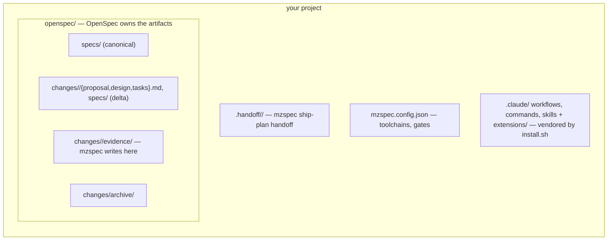

# Architecture

mzspec delivers the spec-driven pipeline natively (using its built-in openspec.js). This doc explains the seam and the state
machine.

> **Before reading:** Make sure you have [installed mzspec](../01-getting-started/01-install.md) and understand the basic flow.
> This doc covers how it works under the hood.

## The layering: mzspec on OpenSpec

OpenSpec owns the **artifact model**; mzspec owns the **delivery pipeline**. Both operate on the
same `openspec/` tree — mzspec never creates a parallel store.

- **OpenSpec provides:** the `openspec` CLI, `openspec init`/`validate`, and the base
  `/opsx:propose`, `/opsx:sync`, `/opsx:archive` commands.
- **mzspec adds:** `/opsx:spec`, `/opsx:spec-pr`, `/opsx:ship-plan`, `/opsx:ship-code`,
  `/opsx:ship`, `/opsx:ship-pr`, `/opsx:address-review`, `/opsx:author-review`, `/opsx:merge-pr`,
  plus the gate engine.

The `/opsx:*` namespace is shared deliberately — mzspec extends OpenSpec's command surface rather
than forking it.

## The two-PR, spec-first state machine

```mermaid
flowchart LR
    P["/opsx:propose<br/>(OpenSpec)"] --> S["/opsx:spec<br/>(review, 7 axes)"]
    S --> SP["/opsx:spec-pr<br/>(sync delta→canonical, open PR)"]
    SP --> HM1["[human merges SPEC PR]<br/>contract now on main"]
    HM1 --> SHIP["/opsx:ship-plan<br/>(TDD units in .handoff/)"]
    SHIP --> SC["/opsx:ship-code<br/>(Red→Green→commit per unit,<br/>Verify gates, Review,<br/>Evidence, Sync-reconcile)"]
    SC --> HM2["[human merges CODE PR]"]
    SC -.-> AR["/opsx:author-review<br/>AI review / comment mode"]
    AR -.-> ADR["/opsx:address-review<br/>(PR feedback loop)"]
    ADR --> HM2
    HM2 --> MP["/opsx:merge-pr<br/>(lead merges PR, closes issue)"]
    MP --> A["/opsx:archive (OpenSpec)"]
```

The agent never merges to the base branch — a human merges both the spec PR and the code PR.

## The gate engine

`lib/gate-resolver.js` maps `git diff --name-only <base>...HEAD` to the exact, deduped set of
quality gates for the change. It resolves the gate inventory through a **3-step chain** (no
central config required):

1. **`openspec/hooks/resolve-gates`** — if this executable exists, run it; its stdout JSON *is*
   the plan. The universal override for any framework/language.
2. **`mzspec.config.json`** — if present, use it (explicit pin; back-compat).
3. **auto-discovery** (`lib/discover.js`, the **zero-config default**) — synthesize the inventory
   from the repo's own manifests: `[tool.uv.workspace]` members / `pyproject.toml` (py), every
   `go.mod` (go), `pnpm-workspace.yaml` packages with a `lint` script (ts), plus the bench ladder
   and the alembic migration gate when present.

Given that inventory, it then **classifies** each touched file to a toolchain by longest-prefix
match, **emits** that toolchain's gates per touched package, **adds** the bench free ladder when a
trigger toolchain/path is touched, and **appends** the always-gates (e.g. `openspec validate`) and
the migration gate when relevant.

The ship-code Verify phase runs every emitted command; each must exit 0. See
[gate-plugin.md](../05-reference/03-gate-plugin.md).

## What stays project-owned

mzspec is generic. Your toolchain inventory is auto-discovered from your manifests; your concrete
gate overrides (`openspec/hooks/resolve-gates`), any explicit config, and your hard-invariants
live in *your* repo, not in mzspec. The `core/gates/starters/ (or see docs/gate-plugin.md)` config shows a
complete real-world setup.

→ **Next:** [Tag-driven skill routing](02-tag-system.md) explains how tasks drive skill and hook
loading during the pipeline.
